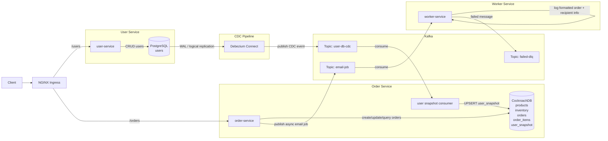

# FlashService

## Architecture



## File Structure

```text
.
├── docker-compose.yml
├── kind-config.yaml
├── db
│   ├── user-init.sql
│   ├── order-init.sql
│   └── user-connector.json
├── k8s
│   ├── namespace.yaml
│   ├── postgres.yaml
│   ├── user-db-init-job.yaml
│   ├── cockroach.yaml
│   ├── order-db-init-job.yaml
│   ├── kafka.yaml
│   ├── kafka-init-job.yaml
│   ├── debezium-connect.yaml
│   ├── debezium-connector-job.yaml
│   ├── user-service.yaml
│   ├── order-service.yaml
│   ├── worker-service.yaml
│   ├── ingress.yaml
│   └── keda-scaledobject.yaml
└── docs
    ├── user-service-api.md
    ├── order-service-api.md
    └── testing-guide.md
```

## 文件

- API 規格：
  - [User Service API](/Users/vincent/Documents/GitHub/FlashService/docs/user-service-api.md)
  - [Order Service API](/Users/vincent/Documents/GitHub/FlashService/docs/order-service-api.md)
- 測試流程：
  - [Testing Guide](/Users/vincent/Documents/GitHub/FlashService/docs/testing-guide.md)
